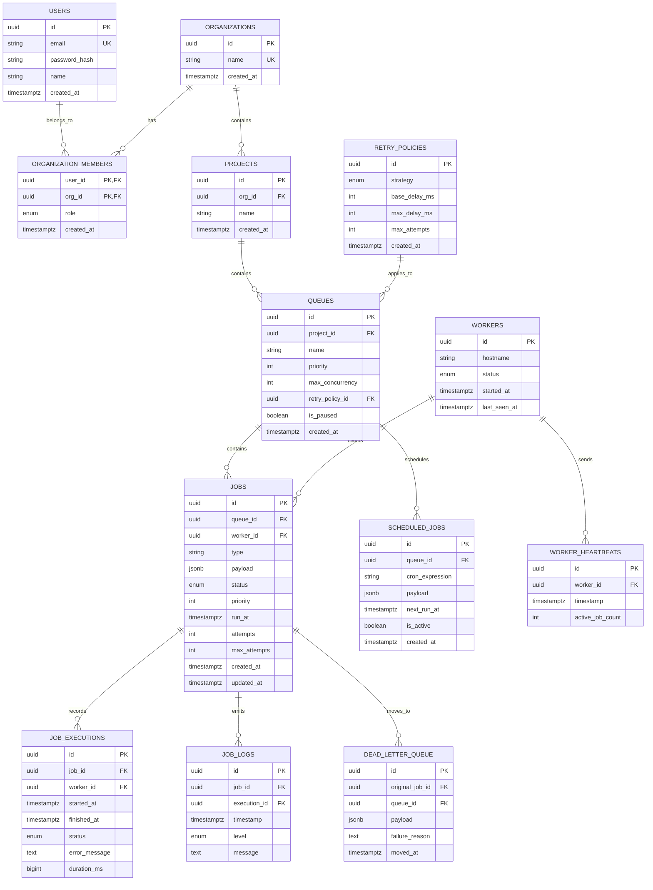

# ER Diagram

```mermaid
erDiagram
    USERS ||--o{ ORGANIZATION_MEMBERS : belongs_to
    ORGANIZATIONS ||--o{ ORGANIZATION_MEMBERS : has
    ORGANIZATIONS ||--o{ PROJECTS : contains
    PROJECTS ||--o{ QUEUES : contains
    RETRY_POLICIES ||--o{ QUEUES : applies_to
    QUEUES ||--o{ JOBS : contains
    WORKERS ||--o{ JOBS : claims
    JOBS ||--o{ JOB_EXECUTIONS : records
    JOBS ||--o{ JOB_LOGS : emits
    JOBS ||--o{ DEAD_LETTER_QUEUE : moves_to
    QUEUES ||--o{ SCHEDULED_JOBS : schedules
    WORKERS ||--o{ WORKER_HEARTBEATS : sends

    USERS {
        uuid id PK
        string email UK
        string password_hash
        string name
        timestamptz created_at
    }

    ORGANIZATIONS {
        uuid id PK
        string name UK
        timestamptz created_at
    }

    ORGANIZATION_MEMBERS {
        uuid user_id PK, FK
        uuid org_id PK, FK
        enum role
        timestamptz created_at
    }

    PROJECTS {
        uuid id PK
        uuid org_id FK
        string name
        timestamptz created_at
    }

    QUEUES {
        uuid id PK
        uuid project_id FK
        string name
        int priority
        int max_concurrency
        uuid retry_policy_id FK
        boolean is_paused
        timestamptz created_at
    }

    RETRY_POLICIES {
        uuid id PK
        enum strategy
        int base_delay_ms
        int max_delay_ms
        int max_attempts
        timestamptz created_at
    }

    WORKERS {
        uuid id PK
        string hostname
        enum status
        timestamptz started_at
        timestamptz last_seen_at
    }

    JOBS {
        uuid id PK
        uuid queue_id FK
        uuid worker_id FK
        string type
        jsonb payload
        enum status
        int priority
        timestamptz run_at
        int attempts
        int max_attempts
        timestamptz created_at
        timestamptz updated_at
    }

    JOB_EXECUTIONS {
        uuid id PK
        uuid job_id FK
        uuid worker_id FK
        timestamptz started_at
        timestamptz finished_at
        enum status
        text error_message
        bigint duration_ms
    }

    SCHEDULED_JOBS {
        uuid id PK
        uuid queue_id FK
        string cron_expression
        jsonb payload
        timestamptz next_run_at
        boolean is_active
        timestamptz created_at
    }

    WORKER_HEARTBEATS {
        uuid id PK
        uuid worker_id FK
        timestamptz timestamp
        int active_job_count
    }

    JOB_LOGS {
        uuid id PK
        uuid job_id FK
        uuid execution_id FK
        timestamptz timestamp
        enum level
        text message
    }

    DEAD_LETTER_QUEUE {
        uuid id PK
        uuid original_job_id FK
        uuid queue_id FK
        jsonb payload
        text failure_reason
        timestamptz moved_at
    }
```
